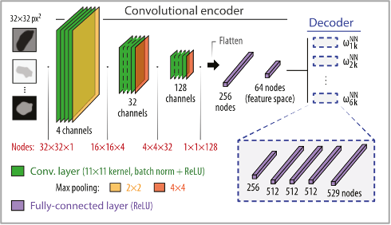

# Machine Learning based Characterization of Photonic Crystals
This repository contains a university project study completed as part of the master in Photonics at the University of Applied Sciences Munich (HM)

## Overview
This repository presents a university project investigating the use of **machine learning (ML)** as a complementary method for the characterization of **photonic crystals (PhCs)**.

The study is **based on and inspired by** the work of Christensen et al. (2020), *Predictive and generative machine learning models for photonic crystals*, published in *Nanophotonics*. Following the core ideas of the article, numerical simulations are combined with supervised learning techniques to explore the prediction of photonic band structures.

  

Using **COMSOL Multiphysics**, electromagnetic wave propagation through photonic crystals with various configurations is simulated and corresponding **band structures** are generated. These band structure images are then used to train a **convolutional neural network (CNN)** capable of predicting band structures from previously unseen input data.

---

## Project Scope and Structure

### 1. Theoretical Background
The first part of the study focuses on the theoretical foundations of photonic crystals, examining the connection between **solid-state physics** and **electromagnetism**, and explaining the physical origin of photonic band structures.

This section also introduces the principles of **machine learning** and **convolutional neural networks**, with particular emphasis on the numerical operations underlying deep learning models that are relevant to this work.

### 2. Methodology
The methodology is divided into two main components:

- **Photonic Crystal Simulations**  
  Numerical simulations of photonic crystals are performed using **COMSOL Multiphysics** to obtain band structures for different geometrical and material configurations.

- **CNN Architecture and Training**  
  A step-by-step explanation of the convolutional neural network architecture is provided, detailing data preprocessing, model design, training procedure, and evaluation strategy used to predict band structures from simulation outputs.

### 3. Results and Analysis
The results section presents:
- Simulated band structures
- CNN predictions on unseen data
- Graphical comparisons and accuracy metrics

These results are used to assess the effectiveness and limitations of the ML-based approach.

### 4. Conclusion and Future Work
The study concludes with a summary of key findings and discusses potential extensions, including improvements to model accuracy, dataset expansion, and future applications of machine learning in photonic crystal research.

## Reference
Christensen, T., Loh, C., Picek, S., Jakobović, D., Jing, L., Fisher, S., Čeperić, V., Joannopoulos, J. D., & Soljačić, M.  
**Predictive and generative machine learning models for photonic crystals**.  
*Nanophotonics*, 2020.

---

## Tools used
- **COMSOL Multiphysics**
- **Python**
- NumPy, SciPy, Matplotlib
- Pytorch
- Machine Learning / Deep Learning (CNN)
